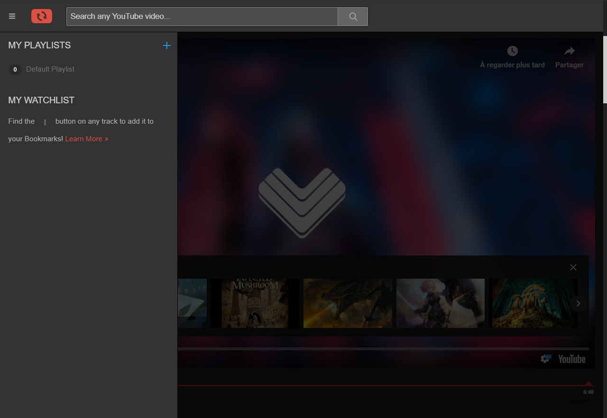

# dark-reppeat
:lipstick: A dark theme for reppeat.com

* dark-reppeat on Stylish - https://userstyles.org/styles/169828/dark-reppeat-com

## Usage
To use this theme, simply add the CSS code to CSS-injecting browser extensions like [Stylish](https://userstyles.org/), [Stylus](https://add0n.com/stylus.html) etc. Once the theme is in action, reppeat.com should look as shown below.

### Here's how it looks like

## Contributing
Found something interesting to add to this theme or rather a :beetle:bug? Let me know about it through the [issue tracker](https://github.com/madmath03/dark-reppeat/issues). [Pull requests](https://github.com/madmath03/dark-reppeat/pulls) are also welcome.

## License 
This theme is released under the [**MIT**](/LICENSE) license.
